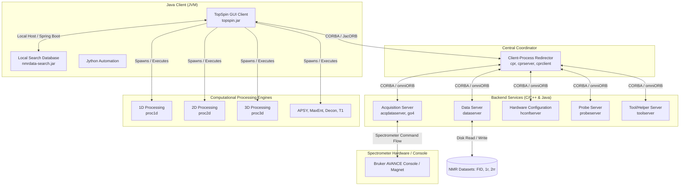

# Bruker TopSpin 5.0.0 Architecture & Components Report

Bruker **TopSpin 5.0.0** is an industry-standard software suite used for NMR (Nuclear Magnetic Resonance) data acquisition, processing, and visualization. It utilizes a **client-server architecture** connected via **CORBA** (Common Object Request Broker Architecture) to separate the user interface from low-level hardware control, file access, and heavy mathematical processing.

---

## 1. High-Level Architecture Diagram

The diagram below visualizes how the Java GUI Client interacts with the native C/C++ backend and hardware controllers through the Client-Process Redirector (CPR).

---

## 2. Component-by-Component Breakdown

### A. The Java GUI Client (Visual Layer)
*   **`topspin.jar` (Main GUI Application):** The primary user interface built using **Java Swing / AWT**. It handles the spectrum display (1D, 2D, 3D), menu interactions, dataset loading, and parameter edits.
*   **`nmrdata-search.jar`:** A locally running **Spring Boot** web application acting as a background search database server. It parses, indexes, and enables rapid keyword search over your local NMR datasets.
*   **`bsmsgui.jar`:** The graphic controller for the Bruker Smart Magnet System (BSMS) used to monitor and adjust lock, shim, and lift settings.
*   **`atma2server.jar` & `BasicSampleChangerServer.jar`:** Java controllers for automating probe tuning/matching (ATMA) and robot sample changers.
*   **Jmol & JChemPaint:** Open-source chemical visualization tools integrated into TopSpin for 3D molecular structures and 2D chemical drawing.

### B. Client-Process Redirector (CPR - Coordination Layer)
*   **`cpr` / `cprserver` / `cprclient`:** Compile native binary components (`cpr` is compiled as a Mach-O 64-bit executable on macOS). It is the central daemon that coordinates requests between the Java GUI and the background processing/acquisition engines. This separation ensures that if the Java GUI freezes or crashes, background data acquisition and mathematical processing continue uninterrupted.

### C. Backend CORBA Services (Spectrometer & System Management)
TopSpin runs several native daemons communicating via **CORBA** (configured using `omniorb.conf` and `jacorb.conf`):
*   **`dataserver`:** Manages file operations for NMR datasets. It reads raw FIDs (free induction decays) and writes processed real/imaginary spectra.
*   **`acqdataserver` & `go4`:** The data acquisition engines. They run the pulse sequences, control transmitter/receiver phases, receive digital signals from the console, and stream them into the data directories.
*   **`hconfserver` (Hardware Configuration Server):** Resolves configurations, power limits, and routing of channels on the spectrometer console.
*   **`probeserver`:** Manages NMR probe head parameters, tuning files, temperature limits, and active nuclei configurations.
*   **`toolserver`:** Executes general system tools, backups, license checks, and utility operations.
*   **`wvm` (Wobble Visualization Module):** Computes and displays the tuning and matching dip (RF sweep curve) during probe calibration.

### D. Computational Engines (Heavy Math Processing)
Written in highly optimized native C/C++ to execute sub-second calculations on large multidimensional datasets:
*   **`proc1d` / `proc2d` / `proc3d`:** Executable engines that compute Fourier transforms, phase corrections (zero and first-order), window functions (apodization), linear prediction extrapolation, and baseline correction.
*   **`apsy` (Automated Projection Spectroscopy):** An algorithm used to automatically determine peak coordinates in multi-dimensional spectra.
*   **`maxent`:** Performs Maximum Entropy reconstructions for resolution enhancement.
*   **`decon`:** Executes peak deconvolution to resolve highly overlapping peaks.
*   **`t1`:** Calculates T1 and T2 relaxation kinetics from variable-delay datasets.
*   **`xwinshape`:** Utility to compute shaped pulse parameters (SNOB, Gaussian, REBURP, etc.) to minimize off-resonance excitation.

### E. Scripting, Automation & Libraries (Extension Layer)
*   **Jython (Java Python):** A Python interpreter compiled inside the Java client, used for executing traditional TopSpin commands and interactive scripts inside the GUI command bar.
*   **Bruker Python 3 API (`bruker_nmr_api` / `ts_remote_api`):** Modern Python libraries (`.whl` wheels included in `/opt/topspin5.0.0/python/examples`) that expose TopSpin control directly to external standard Python runtimes. Users can write scripts in Jupyter Notebooks to pull spectra, run processing functions, and use scientific libraries (`numpy`, `xarray`, `matplotlib`) to plot data.
*   **Perl & AU (Automation Programs):** Perl script tools (such as `makeau`) are used to compile legacy C-like Automation Programs (AU files under `exp/stan/nmr/au`).

---

## 3. Technology Stack Summary

| Technology / Library | Role in TopSpin 5.0.0 |
| :--- | :--- |
| **Java (OpenJDK / JRE 11/17)** | GUI Presentation Layer, Search Engine (Spring Boot), Sample Changer servers. |
| **C / C++ (Native Compiled)** | Mathematical processing engines (`proc1d`, `decon`), system coordinator (`cpr`), and spectrometer interface (`go4`). |
| **CORBA (omniORB / JacORB)** | Middleware facilitating IPC (Inter-Process Communication) between the Java client and native C++ servers. |
| **Python 3 / Jython** | User automation scripting, batch processing, and external Python API interaction. |
| **Perl** | Legacy script parsing and AU program compilation. |
| **Batik / Jmol / JChemPaint** | Graphical rendering tools (SVG, 3D molecule visuals, 2D structure drawing). |
